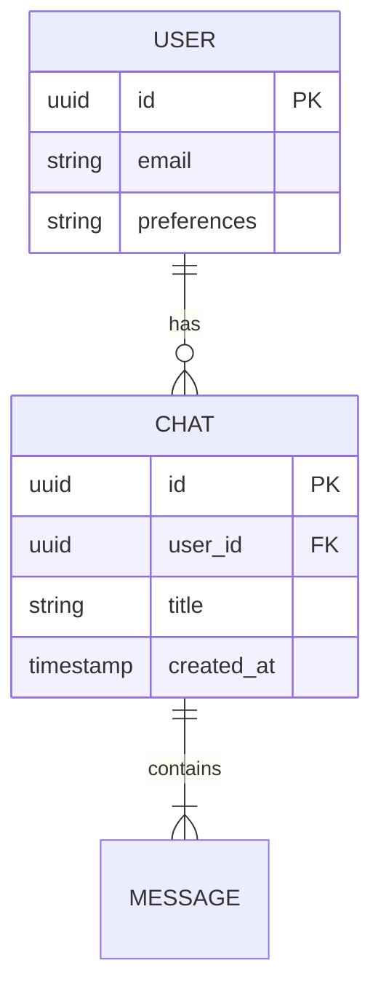

# Database Schema Design

**Module:** [Module Name]

## 1. Entity Relationship Diagram (Mermaid)

## 2. Table Definitions

### Table: `[table_name]`
| Column | Type | Nullable | Default | Description |
| :--- | :--- | :--- | :--- | :--- |
| `id` | UUID | No | uuid_generate_v4() | Primary Key |
| `created_at` | TIMESTAMP | No | NOW() | |
| `metadata` | JSONB | Yes | {} | Flexible storage for AI context |

## 3. Indexes & Performance
*List any specific indexes needed for query performance.*
- Index on `user_id` for fast history lookup.
- Vector Index (HNSW) on `embedding` column.
