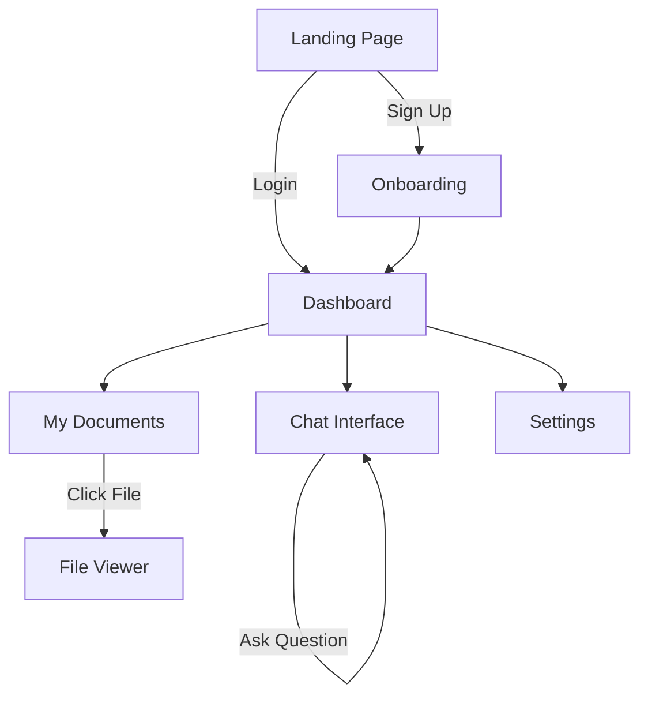

# User Flows (Sitemap & Navigation)

This document visualizes the macro navigation of the application.

## High-Level Sitemap

## Core Journeys

### 1. The "Ask AI" Journey
1. **Entry**: User clicks "New Chat".
2. **Context**: User selects 1-3 Documents to reference.
3. **Turn 1**: User asks question -> AI Answers (Stream).
4. **Validation**: User clicks citation -> PDF Viewer opens to specific page.

### 2. The "Upload" Journey
1. **Action**: User drags file to Dashboard.
2. **System**:
   - Upload file to Storage.
   - Trigger OCR / Text Extraction.
   - Generate Embeddings (Vector DB).
3. **Feedback**: Notify user "File Ready to Chat".
